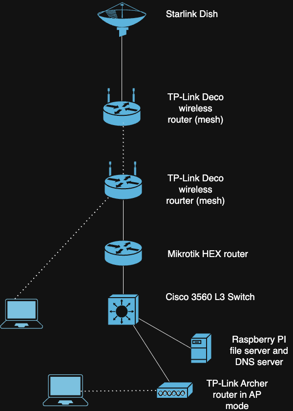

# 🏠 My HomeLab Setup

This page documents my personal homelab, which I use to build experience in **networking**, **Linux system administration**, and **automation**.

---

## 🗺️ Network Diagram

---

## 🔧 Homelab Hardware

- Raspberry Pi 5 running Ubuntu Server
- MikroTik hEX router
- Cisco Catalyst 3560
- TP-Link Deco mesh Wi-Fi set-up
- 1.5 TB of storage for file server on PI

---

## 🛠️ Services & Tools

- Samba file server
- Ansible automation for Linux device patching
- Pi-hole DNS server and filtering
- Netdata monitoring for file server and DNS server
- Wireshark for packet analysis
- Tailscale for private and always-on access to internal network

---

## 🎯 Skills I'm Developing

- Switching and routing with Cisco IOS
- Linux administration 
- Ansible playbooks and SSH automation
- Firewall and NAT rules on MikroTik and Cisco L3 switch
- DNS, DHCP, VPN, and system monitoring

---
